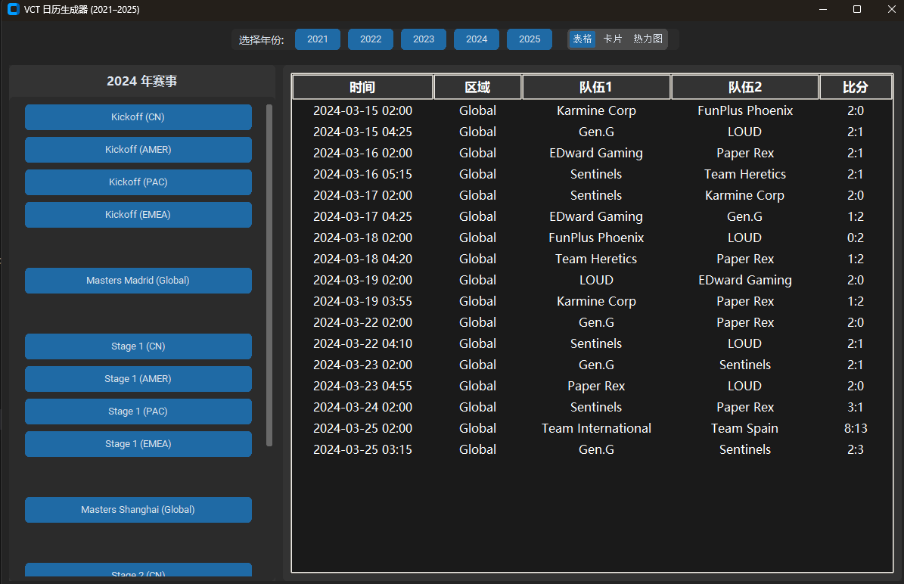
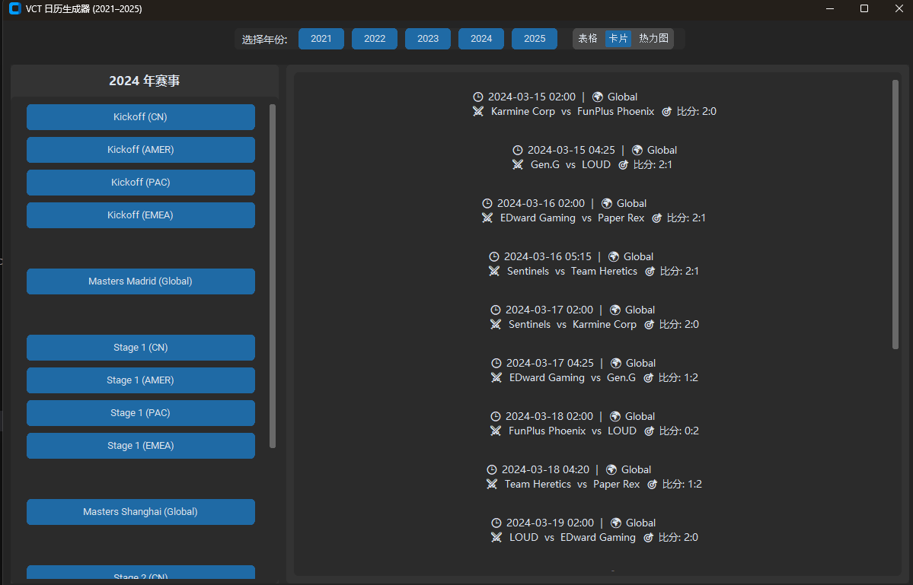
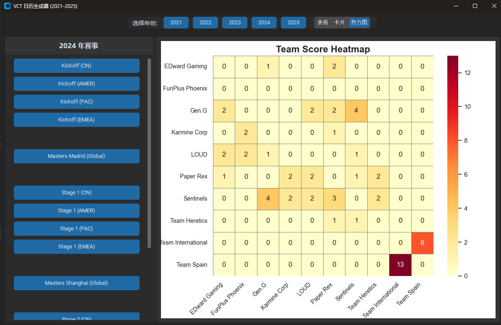

# VLR.gg Valorant Match Scraper

[English](README.md) | [简体中文](README.zh.md)

---

## 📖 Project Overview

This project is a Python-based crawler and GUI viewer for **Valorant** match data from [VLR.gg](https://www.vlr.gg). It supports calendar export (`.ics`), interactive GUI views (table, card, heatmap), and match tracking across regions and years.

The automated calendar currently covers **VCT 2026 Stage 2** in AMER, PAC, EMEA, and CN. GitHub Actions refreshes it every day at **14:00 Australia/Sydney**, with daylight-saving changes handled by the named timezone.

---

## 🎯 Features

- **🎮 Match Information Crawling**: Includes match name, time, teams, score.
- **📅 Calendar File Export**: Converts crawled data to `.ics` files.
- **🖥️ GUI with Multi-view Support**:
  - **Table View**: Full structured list.
  - **Card View**: Compact team-by-team format.
  - **Heatmap View**: Team score matrix via seaborn.
- **📂 Scrollable Event List**: Easily browse all events from 2021–2026.
- **📱 Calendar Sync**: Subscribe to `vct_OnGoing.ics` in your calendar.
- **🔄 Stable Incremental Updates**: Every match has a stable UID to prevent duplicate calendar events.

---

## 🖼 GUI Screenshots

| Table View | Card View | Heatmap View |
|------------|-----------|--------------|
|  |  |  |

To use GUI:

```bash
python GUI.py
```

---

## 📅 Subscribe in Calendar

Subscribe to the automatically updated Stage 2 calendar:

- **VCT 2026 Stage 2 — AMER, PAC, EMEA, and CN**:

  https://raw.githubusercontent.com/Adamchen566/VCT-matches-to-iCal/main/vct_OnGoing.ics

### Usage:

- **Google Calendar**: Settings → Add Calendar → From URL → Paste the link above.
- **iOS/macOS Calendar**: File → New Calendar Subscription → Paste link.
- **Xiaomi/Android system calendars**: Use a network ICS subscription sync app such as [ICSx⁵](https://icsx5.bitfire.at/), add the URL, enable automatic sync, and make the subscribed calendar visible in the system calendar. A one-time file import will not auto-update.

---

## 🚀 Quick Start

### 📋 Requirements

- Python 3.x
- Works on: Windows / macOS / Linux

### 📦 Dependencies

```bash
python -m pip install -r requirements.txt
```

### 🔧 Installation

```bash
git clone https://github.com/Adamchen566/VCT-matches-to-iCal
cd VCT-matches-to-iCal
python update_stage2_calendar.py
python update_stage2_calendar.py --check
```

Generated files:

- `vct_OnGoing.ics`: calendar subscription feed
- `vct_OnGoing.txt`: readable schedule in Australia/Sydney time
- `data/vct_stage2_matches.json`: match cache used for stable updates

---

## 📜 License

MIT License. See [LICENSE](LICENSE).

---

## 💬 Feedback & Contribution

1. Submit Issues for bugs or suggestions.
2. Fork the repo and submit a Pull Request.

Thanks for using this tool! 🎉
