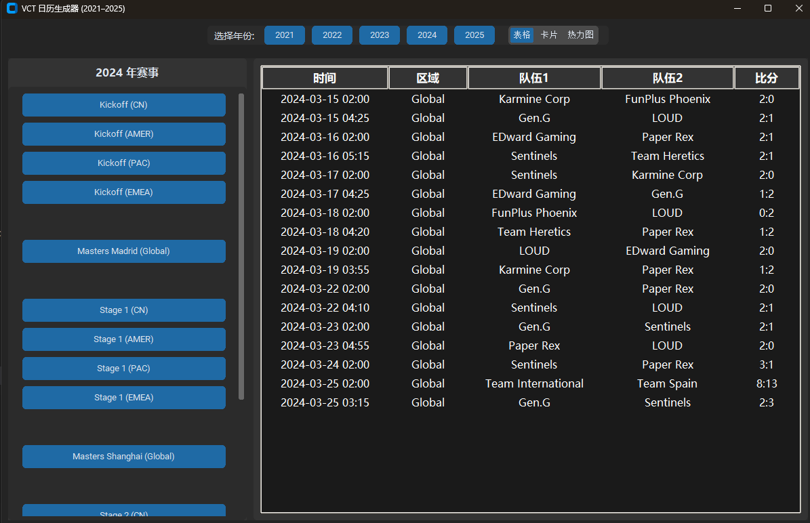
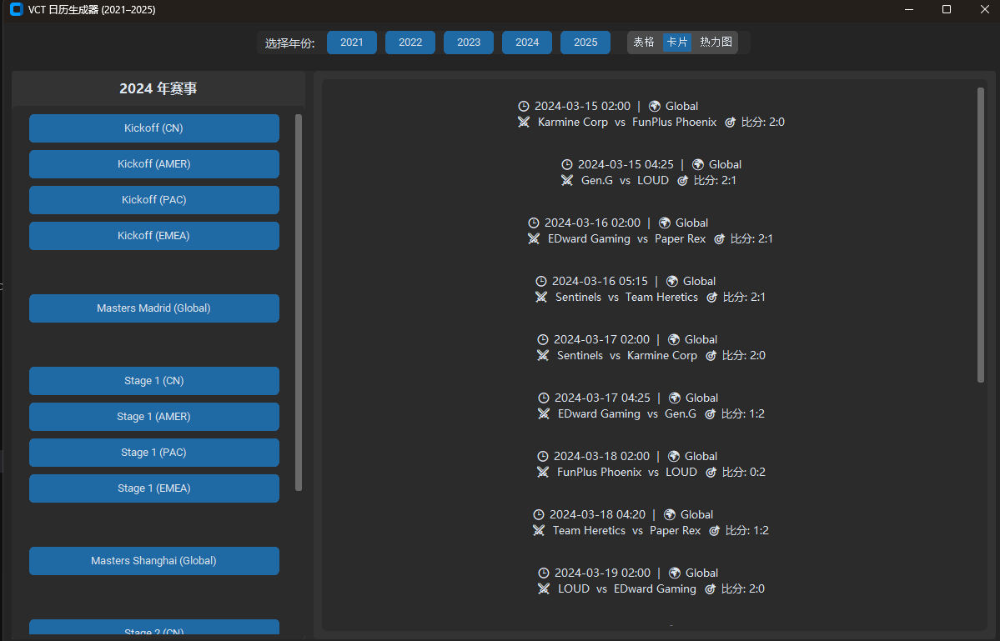
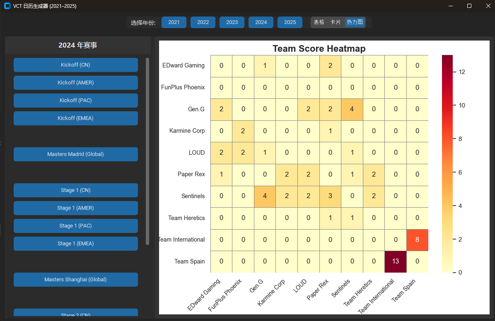

# VLR.gg Valorant Match Scraper

[English](README.md) | [简体中文](README.zh.md)

---

## 📖 Project Overview

This project is a Python-based crawler and GUI viewer for **Valorant** match data from [VLR.gg](https://www.vlr.gg). It supports calendar export (`.ics`), interactive GUI views (table, card, heatmap), and match tracking across regions and years.

---

## 🎯 Features

- **🎮 Match Information Crawling**: Includes match name, time, teams, score.
- **📅 Calendar File Export**: Converts crawled data to `.ics` files.
- **🖥️ GUI with Multi-view Support**:
  - **Table View**: Full structured list.
  - **Card View**: Compact team-by-team format.
  - **Heatmap View**: Team score matrix via seaborn.
- **📂 Scrollable Event List**: Easily browse all events from 2021–2025.
- **📱 Calendar Sync**: Subscribe to `vct_OnGoing.ics` in your calendar.

---

## 🖼 GUI Screenshots

| Table View | Card View | Heatmap View |
|------------|-----------|--------------|
|  |  |  |

To use GUI:

```bash
python GUI.py
```

---

## 📅 Subscribe in Calendar

To stay updated with ongoing matches, import or subscribe to the provided `.ics` file:

- **File**: `vct_OnGoing.ics`
- **Usage**:
  - Google Calendar: Settings → Add Calendar → From URL → Paste public link to `.ics`
  - iOS: Settings → Calendar → Accounts → Add Account → Other → Add Subscribed Calendar

---

## 🚀 Quick Start

### 📋 Requirements

- Python 3.x
- Works on: Windows / macOS / Linux

### 📦 Dependencies

```bash
pip install requests beautifulsoup4 ics customtkinter matplotlib seaborn pandas
```

### 🔧 Installation

```bash
git clone https://github.com/Adamchen566/VCT-matches-to-iCal
cd vlr-gg-scraper
```

---

## 📜 License

MIT License. See [LICENSE](LICENSE).

---

## 💬 Feedback & Contribution

1. Submit Issues for bugs or suggestions.
2. Fork the repo and submit a Pull Request.

Thanks for using this tool! 🎉
