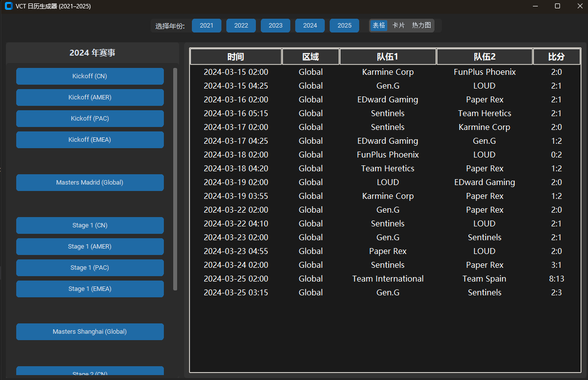
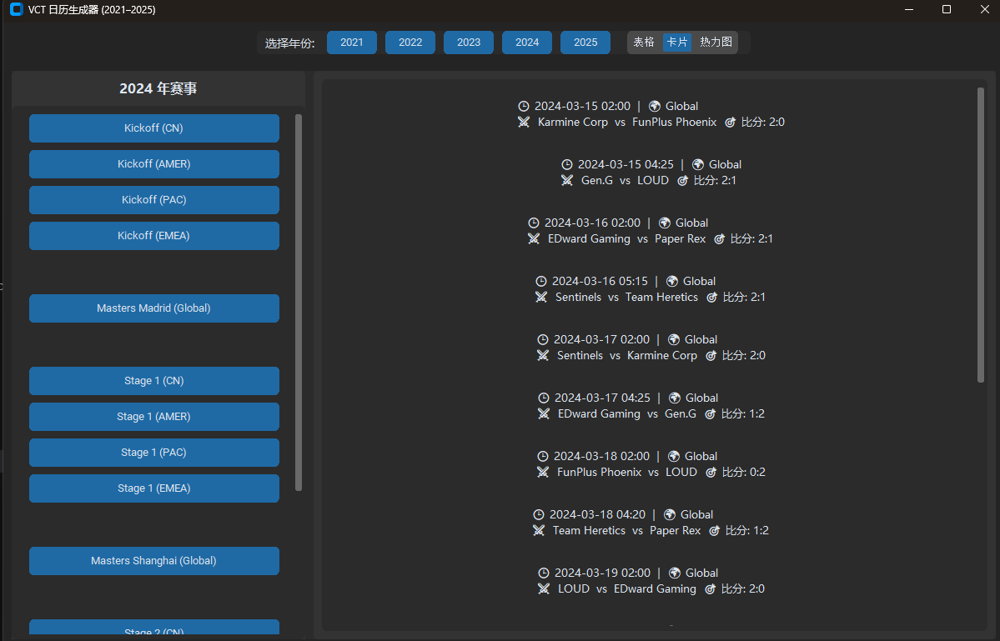
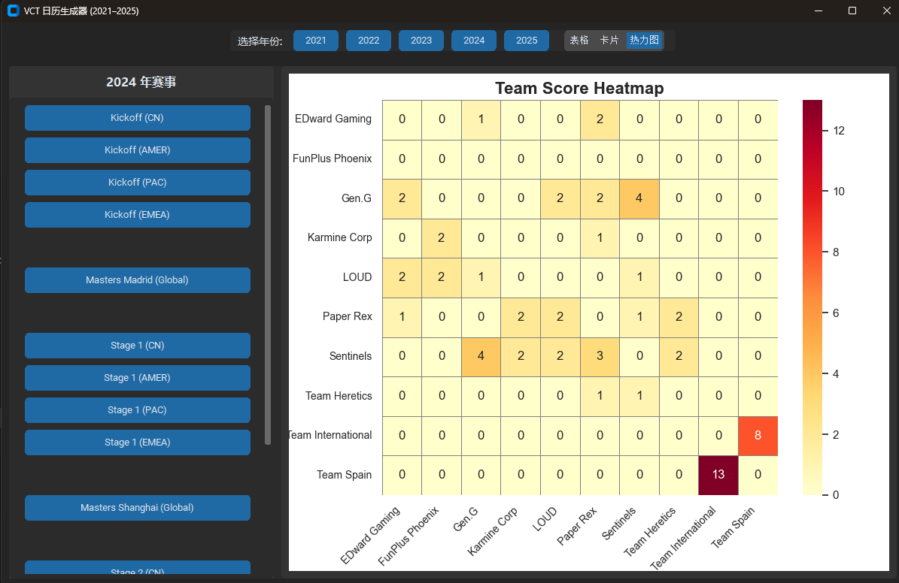

# VLR.gg Valorant 比赛日程工具

[English](README.md) | [简体中文](README.zh.md)

---

## 📖 项目概览

本项目是一个基于 Python 的 **Valorant（无畏契约）比赛数据爬虫与可视化工具**，从 [VLR.gg](https://www.vlr.gg) 抓取数据，支持 `.ics` 日历导出、图形界面多种视图展示，以及多年份多赛区的比赛信息追踪。

---

## 🎯 功能特色

- **🎮 比赛信息抓取**：抓取比赛名称、时间、参赛队伍和比分。
- **📅 日历导出支持**：将比赛信息转换为 `.ics` 文件，支持日历同步。
- **🖥️ 多视图 GUI 显示**：
  - **表格视图**：结构化完整比赛列表。
  - **卡片视图**：按队伍呈现的紧凑视图。
  - **热力图视图**：使用 seaborn 绘制的队伍胜负矩阵。
- **📂 可滚动赛事列表**：快速浏览 2021–2025 年全部赛事。
- **📱 日历订阅功能**：可在系统日历中订阅 `vct_OnGoing.ics` 实时更新。

---

## 🖼 图形界面截图

| 表格视图 | 卡片视图 | 热力图视图 |
|---------|----------|------------|
|  |  |  |

使用方法：

```bash
python GUI.py
```

---

## 📅 日历订阅说明

想实时掌握正在进行的比赛？你可以导入或订阅项目中生成的 `.ics` 文件：

- **文件**：`vct_OnGoing.ics`
- **订阅方式**：
  - Google 日历：设置 → 添加日历 → 来自 URL → 粘贴 `.ics` 链接
  - iOS：设置 → 日历 → 账户 → 添加账户 → 其他 → 添加订阅日历

---

## 🚀 快速开始

### 📋 环境要求

- Python 3.x
- 支持系统：Windows / macOS / Linux

### 📦 安装依赖

```bash
pip install requests beautifulsoup4 ics customtkinter matplotlib seaborn pandas
```

### 🔧 安装方式

```bash
git clone https://github.com/Adamchen566/VCT-matches-to-iCal
cd vlr-gg-scraper
```

---

## 📜 协议许可

本项目遵循 MIT 开源协议，详见 [LICENSE](LICENSE)。

---

## 💬 问题反馈与贡献

1. 发现 bug 或提出建议请提 Issue。
2. 欢迎 Fork 项目并提交 Pull Request！

感谢使用本工具！🎉
